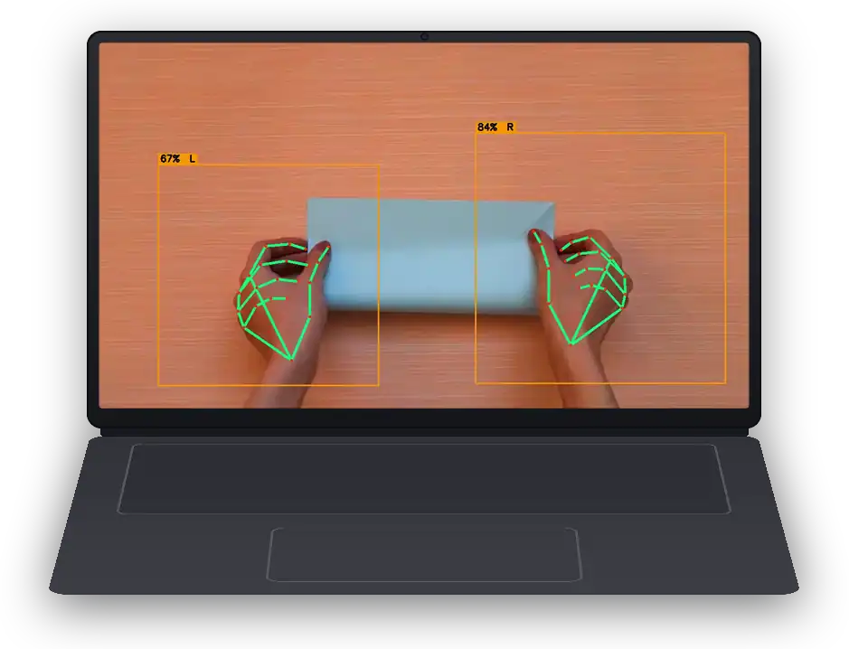

<p align="center">
  
</p>

<p align="center">
<a href="https://flutter.dev"></a>
<a href="https://dart.dev"></a>
<br>
<a href="https://pub.dev/packages/flutter_litert"></a>
<a href="https://pub.dev/packages/flutter_litert/score"></a>
<a href="https://github.com/hugocornellier/flutter_litert/actions/workflows/flutter-ci.yml"></a>
<a href="https://github.com/hugocornellier/flutter_litert/blob/main/LICENSE"></a>
</p>

<hr>

A Flutter plugin for on-device ML inference using LiteRT (formerly TensorFlow Lite), with bundled native runtimes for Android, iOS, macOS, Windows, and Linux, plus web runtimes for Flutter Web.

It started as a fork of [`tflite_flutter`](https://pub.dev/packages/tflite_flutter), the TensorFlow Lite plugin for Flutter, and keeps that interpreter API source-compatible on native platforms. This plugin adds the modern LiteRT Next CompiledModel path, auto bundles the native dynamic libraries, adds newer utilities, adds and improves delegate support, and adds web support.

<!--
  Demo WebPs below: encode ALL-KEYFRAMES so no frame blends over a previous one.
  The rounded phone bezels carry semi-transparent shadow pixels; under
  dispose:none + blend:yes some browser GPU compositors accumulate them
  frame-over-frame and darken the corners ("black corners"). Encoding every
  frame as a full-canvas keyframe (blend=no) makes that impossible.
  Encode: img2webp -kmin 1 -kmax 1 -exact -lossy -q <Q> -m 6 -d <ms> <frames...>
  Keep each file under 10 MB.

  Size these with percentage width= (NOT height=). pub.dev's README stylesheet
  forces `img{height:auto}`, discarding any height= attribute, so height-sized
  devices render at natural width (1238px / 939px) and wrap onto separate lines.
  Percentage width= is honored by both pub.dev and GitHub (see the 100% banner
  above), scales with the column, and keeps the phone and laptop side by side.
  The phone is ~0.61 aspect and the laptop ~1.31, so 30% + 64% renders them at
  matching height while the total stays under 100% (they never wrap).
-->
<p align="center">
  
  &nbsp;&nbsp;&nbsp;
  
  <br>
  <sub><i style="color: #888; display: inline-block; margin-bottom: 5px;">Performant, cross-platform on-device ML inference, from a single Flutter codebase.</i></sub>
</p>

## Two runtimes, one package

`flutter_litert` supports two inference APIs: `CompiledModel`, the recommended default, and `Interpreter`, for cases that need it.

- **`CompiledModel` (LiteRT Next), recommended.** The modern path and the recommended way to get GPU and NPU acceleration. See [CompiledModel (LiteRT Next)](#compiledmodel-litert-next) 
- **`Interpreter` (classic), fully supported.** The TensorFlow Lite / LiteRT runtime, source-compatible with `tflite_flutter`. See [Interpreter (classic API)](#interpreter-classic-api)

## Features

- `CompiledModel` (LiteRT Next), the recommended path. Request accelerators and the runtime picks CPU, GPU, or NPU automatically, with CPU fallback. See [CompiledModel (LiteRT Next)](#compiledmodel-litert-next).
- The classic `Interpreter` API remains fully supported when needed.
- Auto-bundled native libraries. No hand-built `.so`, `.dll`, or `.dylib` files: just add the dependency and it works on Android, iOS, macOS, Windows, and Linux (plus web via `initializeWeb()`). See [Platform support](#platform-support).
- Interpreter delegates. XNNPACK (CPU) on all native platforms, plus GPU, Metal, and CoreML. None are deprecated: `CompiledModel` is the newer API but currently miscomputes some models, so delegate-backed `Interpreter` inference stays a first-class path. See [Delegates](#delegates).
- On-device training with weight persistence and [variable tensor inspection](#inspecting-variable-tensors). See [On-device training](#on-device-training).
- Custom ops. MediaPipe's `Convolution2DTransposeBias` is included on native platforms, and you can register your own. See [Custom ops](#custom-ops).
- Isolate support. Background-thread inference via `IsolateInterpreter` on native platforms (web provides a compatibility wrapper).
- Web support. Two interchangeable runtimes: `tflite-js` (CPU/WASM) and Google's LiteRT.js with an optional WebGPU path. See [Web support](#web-support).

## Quick start

Start with `CompiledModel`, the recommended LiteRT Next path. You request a set of accelerators and the runtime selects the best available backend, with CPU fallback:

```dart
import 'package:flutter_litert/flutter_litert.dart';

final model = CompiledModel.fromFile(
  'model.tflite',
  accelerators: {Accelerator.gpu, Accelerator.cpu}, // GPU with CPU fallback
);

final outputs = model.run(inputs); // List<Float32List> in, List<Float32List> out
model.close();
```

See [CompiledModel (LiteRT Next)](#compiledmodel-litert-next) for accelerator selection, precision options, and the zero-copy hot path.

Use the classic `Interpreter` when you need web, on-device training, custom ops, named signatures, quantized or integer I/O, or a drop-in `tflite_flutter` replacement:

```dart
import 'package:flutter_litert/flutter_litert.dart';

final interpreter = await Interpreter.fromAsset('model.tflite');

// Prepare input and output buffers
var input = [/* your input data */];
var output = List.filled(outputSize, 0.0).reshape([1, outputSize]);

interpreter.run(input, output);
```

See [Interpreter (classic API)](#interpreter-classic-api) for isolates, delegates, training, and custom ops.

## Migrating from tflite_flutter

[`tflite_flutter`](https://pub.dev/packages/tflite_flutter) is no longer
maintained. This package began as a fork of it and keeps the `Interpreter` API
source-compatible on native platforms, so most projects migrate by changing two
lines.

**1. Swap the dependency.**

```yaml
dependencies:
  # tflite_flutter: ^0.11.0
  flutter_litert: ^3.8.0
```

**2. Change the import.**

```dart
// import 'package:tflite_flutter/tflite_flutter.dart';
import 'package:flutter_litert/flutter_litert.dart';
```

Existing `Interpreter` code keeps working unchanged: `Interpreter.fromAsset`,
`fromFile`, `fromBuffer`, `run`, `runForMultipleInputs`, `InterpreterOptions`,
`getInputTensors`, `getOutputTensors`, signature runners, and the delegate
classes all keep their names and signatures.

**3. Delete your native library setup.** This is the step most projects forget.
`tflite_flutter` required you to download `libtensorflowlite_c` yourself and
wire it into each platform build, usually through `install.sh`, a Podfile
tweak, or a CMake edit. flutter_litert bundles the native runtimes for every
supported platform, so all of that can go.

### What you gain

- **Bundled native runtimes.** No `install.sh`, no manually vendored `.so`,
  `.dylib`, or `.dll`.
- **Flutter Web**, which `tflite_flutter` never supported. See
  [Web support](#web-support).
- **The `CompiledModel` API** (LiteRT Next) for GPU and NPU acceleration, which
  is where current upstream development happens. See
  [CompiledModel (LiteRT Next)](#compiledmodel-litert-next).
- **Working delegates**, including Metal on macOS and Core ML, plus diagnostics
  such as `verifyCompiledModel` for catching a backend that silently returns
  wrong output.
- Maintenance: LiteRT runtimes are updated here as upstream ships them.

### Worth knowing

- `CompiledModel` is float32-only. Quantized and integer I/O, on-device
  training, custom ops, and named signatures stay on the classic `Interpreter`,
  which is fully supported and not deprecated.
- Delegate construction is unchanged, but GPU behaviour differs by platform.
  Read [Accelerator selection and precision](#accelerator-selection-and-precision)
  before assuming a delegate engaged; a delegate that fails to apply can fall
  back to CPU without an error.

## Demos and examples

### Examples

A full native example app is available on pub.dev: [flutter_litert example](https://pub.dev/packages/flutter_litert/example). It depends on bundled assets from this repo's `example/` directory (`.tflite` model, label map, and sample images), so if you copy code from pub.dev, clone the repo and run it from `example/`:

```sh
git clone https://github.com/hugocornellier/flutter_litert
cd flutter_litert/example
flutter run
```

For web, see [Web support](#web-support).

The optional `flutter_litert_flex` addon is tested separately in `example/flex_test_host` so the main example stays dependency-light.

### Demos

Packages built on flutter_litert:

| Package | Description | Includes Web |
|---------|-------------|--------------|
| [face_detection_tflite](https://pub.dev/packages/face_detection_tflite) | Face detection, 468-point mesh, iris tracking, segmentation | ✓ |
| [hand_detection](https://pub.dev/packages/hand_detection) | Hand detection, landmarks, gesture recognition | ✓ |
| [pose_detection](https://pub.dev/packages/pose_detection) | Body pose estimation with 33 keypoints | ✓ |
| [object_detection](https://pub.dev/packages/object_detection) | Object detection with bounding boxes and labels | |
| [animal_detection](https://pub.dev/packages/animal_detection) | Animal detection with species classification and pose | |
| [cat_detection](https://pub.dev/packages/cat_detection) | Cat face detection, landmarks, breed identification | |
| [dog_detection](https://pub.dev/packages/dog_detection) | Dog face detection, landmarks, breed identification | |

## CompiledModel (LiteRT Next)

`CompiledModel` is the LiteRT Next inference path and the recommended way to run models with GPU or NPU acceleration. Instead of manually creating and attaching a delegate, you request a set of accelerators and the runtime selects the best available backend (CPU, GPU, or NPU) for the model. This follows Google's [LiteRT Next guidance](https://developers.google.com/edge/litert/next/get_started). Supported on Android, iOS, macOS, Windows, Linux, and web (async API only; see [CompiledModel on the web](#compiledmodel-on-the-web)).

`CompiledModel` runs Float32 models only (`run()` takes `List<Float32List>` and returns `List<Float32List>`). For on-device training, custom ops, named signatures, or quantized and integer I/O, use the [Interpreter (classic API)](#interpreter-classic-api) instead.

### Accelerator selection and precision

```dart
final model = CompiledModel.fromFile(
  'model.tflite',
  accelerators: {Accelerator.gpu, Accelerator.cpu}, // GPU with CPU fallback
  precision: Precision.fp32, // the default
);
final outputs = model.run(inputs); // List<Float32List> in, List<Float32List> out
model.close();
```

- Include `Accelerator.cpu` in the `accelerators` set to allow CPU placement when compilation succeeds. When a bundled GPU accelerator is present but cannot initialize, combined `{gpu, cpu}` compilation can still fail instead of falling back internally. Use the convenience factory below when a working GPU-to-CPU retry is required.
- `precision` accepts `Precision.fp16` or `Precision.fp32`, and defaults to
  `Precision.fp32`. Across the 29 published detection models, strict-GPU fp32
  matched a plain-CPU reference for every model that compiled on all four GPU
  architectures measured, while fp16 matched only 4 of 18 on Adreno, 5 of 18 on
  Xclipse, 4 of 18 on Apple Metal, and 1 of 12 on Mali. Google's LiteRT Python
  API reproduces those Apple figures, so this is upstream numerical behaviour
  rather than a binding artefact: fp16 has roughly three decimal digits of
  mantissa and these graphs emit pixel-space coordinates. Treat `fp16` as a
  per-model opt-in you have validated on the target GPU. See
  [GPU vendor matrix](test/benchmark/GPU_VENDOR_MATRIX.md).
- On iOS 13+ and macOS 13+ Apple Silicon, `Accelerator.npu` uses a dedicated
  Core ML `CPUAndNeuralEngine` backend. The iOS source implementation is
  simulator-validated; physical-device validation and its replacement SwiftPM
  binary artifact remain pending at this checkpoint. See
  [CompiledModel NPU on Apple platforms](#compiledmodel-npu-on-apple-platforms).
- On Android, `Accelerator.gpu` uses the bundled OpenCL/GL accelerator on `arm64-v8a` and `x86_64`. `armeabi-v7a` remains CPU-only.
- On Android API 31+ arm64, `Accelerator.npu` can use an app-provided LiteRT
  vendor runtime. NPU binaries are SoC-specific and are not bundled by default.
  See [CompiledModel NPU on Android](#compiledmodel-npu-on-android).

### GPU with CPU fallback (convenience method)

For the common "GPU if available, otherwise CPU" case there is a convenience method:

```dart
final model = CompiledModel.fromBufferWithGpuFallback(modelBytes);
```

This first requests `{gpu, cpu}`. If compilation fails because the GPU is unavailable, an operation is unsupported, or a driver fails, it reports the error through the optional `onFallback` callback and retries CPU-only. `CompiledModel.fromBufferWithGpuFallbackAsync` provides the same guaranteed-model path through the portable async API.

Android emulators are a common case: the accelerator library can register, but emulators do not provide working OpenCL, so direct `{gpu, cpu}` compilation returns an error. The fallback factories catch that error and return a CPU model.

### NPU support status

NPU maturity differs sharply by platform. Treat this table as the contract:

| Platform | Status | Backend | Notes |
|---|---|---|---|
| **macOS** | **Works; accuracy is model-specific** | Core ML, Apple Neural Engine | Apple Silicon, macOS 13+. Strict `{npu}` places a full graph for 1 of 29 published models; `{npu, cpu}` runs 24 of 29 with 12 matching a CPU reference. Working does not mean safe to enable blindly: validate each model. |
| **iOS** | **Works; accuracy is model-specific** | Core ML, Apple Neural Engine | iOS 13+, from `coreml-ios-v1.1.0`. Earlier releases shipped a Core ML framework predating the NPU entry points, so registration failed on device with `kLiteRtStatusErrorUnsupported`. Measured on a physical iPhone 15 Pro: strict `{npu}` places a full graph for 1 of 29 published models, and `{npu, cpu}` runs 24 of 29 with 12 matching a CPU reference. Identical to macOS on both counts. |
| **Android** | **Work in progress** | Qualcomm HTP only | One vendor. Requires an app-provided JIT runtime; nothing is bundled. Validated on SM8550/v73, SM8650/v75, and SM8750/v79. MediaTek, Google Tensor, and Exynos NPUs are not supported. |
| **Windows** | **Not yet** | — | LiteRT documents an Intel OpenVINO NPU backend; no bindings here yet. |
| **Linux** | **Not yet** | — | Same as Windows. |
| **Web** | **Not applicable** | — | `Accelerator.npu` throws. Use WebGPU through `Accelerator.gpu`. |

### NPU accuracy is bounded by fp16, and that cannot be configured away

The Apple Neural Engine is fp16 hardware. Core ML converts a float32 model to
fp16 to run on it, and `CoreMlDelegateOptions` exposes no precision control,
because there is nothing to control: fp32 is not on offer. The same is true of
`Accelerator.npu` on Apple, which routes through Core ML.

That matters because fp16 carries roughly three decimal digits of mantissa,
and detection and landmark models emit pixel-space coordinates. Measured across
the 29 published models on macOS, every model the Core ML delegate computed
incorrectly was computed correctly on an fp32 path, and most of them are the
same models that fail on GPU fp16:

| | Models |
|---|---:|
| Inaccurate under Core ML | 11 |
| ...also inaccurate on GPU fp16 | 8 |
| ...also inaccurate on Metal fp16 | 9 |
| ...that any fp32 path gets right | all of them |

So Core ML, Metal fp16, and CompiledModel GPU fp16 are one failure wearing
three hats.

A physical iPhone 15 Pro reproduces this exactly: 24 of 29 models on Core ML
with 13 accurate, and `{npu, cpu}` running 24 with 12 accurate, matching an M4
Mac model for model. Two Neural Engine generations, the same failures on the
same graphs, which is what a precision limit looks like rather than a driver
quirk on one chip.

The practical consequence is a real asymmetry between GPU and NPU:

- **GPU**: choosing `Precision.fp32` fixes it. That is why fp32 is now the
  default.
- **NPU**: there is no equivalent. The hardware is fp16 and the API has no
  knob, so a model that loses too much precision on the Neural Engine cannot be
  rescued by configuration.

For NPU the only options are to validate that specific model against a CPU
reference and accept the result, or not to use the NPU for it. Run
`verifyCompiledModel` at initialisation rather than assuming; a graph can
dispatch fully to the accelerator and still return wrong numbers, which is
exactly what the physical-device runs found on both Apple and Qualcomm
hardware.

Note also that Core ML *accepting* a model implies nothing about correctness.
The bundled Core ML build carries a patch that fixes a spurious rejection of
global-spatial `MEAN`, which moved four models from rejected to executing on
both macOS and iOS. Three of those four now produce inaccurate output where
previously they were rejected and fell back to CPU. The patch did not cause
that; it exposed precision behaviour the rejection had been masking.

On Android specifically: the NPU runtime is never bundled, because each SoC
vendor needs its own. A device with no matching runtime is expected, not an
error case. Strict `{Accelerator.npu}` throws an actionable `UnsupportedError`
there, while a mixed request such as `{Accelerator.npu, Accelerator.cpu}` drops
the unavailable NPU and continues on the fallback you asked for. The model's
`accelerators` getter reports the effective set, so compare it against what you
requested if you need to know which path you got.

Accuracy is also model-specific on NPU hardware. In physical-device testing,
some models matched their CPU reference within tolerance while others did not,
on otherwise fully dispatched graphs. Validate each model on each target SoC
before enabling NPU in production.

### CompiledModel NPU on Apple platforms

iOS 13 or newer and macOS 13 or newer on Apple Silicon can request the Apple
Neural Engine:

```dart
// Every TFLite op must be accepted by the Core ML accelerator.
final strict = CompiledModel.fromFile(
  'model.tflite',
  accelerators: {Accelerator.npu},
);

// Core ML gets first choice; XNNPACK handles the remaining operations.
final mixed = CompiledModel.fromFile(
  'model.tflite',
  accelerators: {Accelerator.npu, Accelerator.cpu},
);
```

The backend uses `MLComputeUnitsCPUAndNeuralEngine`, which excludes the GPU.
Apple does not expose a Neural-Engine-only compute-unit mode, so Core ML may
still place unsupported layers on the CPU internally. Strict `{npu}` means the
whole TFLite graph was accepted by the Core ML delegate; it cannot promise that
every Core ML layer ran on the ANE.

The mixed mode registers Core ML before XNNPACK. It also rejects compilation if
Core ML claims zero nodes, instead of silently returning a CPU-only model.
`{npu, gpu}` is not supported on Apple platforms in this implementation because
LiteRT delegate ordering would make the selected backend ambiguous.

Always validate a production model with `verifyCompiledModel`: ANE arithmetic
can change outputs, and some model architectures exceed the default 1%
tolerance even though Core ML successfully delegates nodes.
`isFullyAccelerated` is not an NPU-engagement detector in mixed mode because
XNNPACK can delegate the remainder. The tested model matrix, known incompatible
models, build details, and exact semantics are in
[macOS CompiledModel NPU](doc/macos_compiled_model_npu.md) and
[iOS CompiledModel NPU](doc/ios_compiled_model_npu.md). The iOS simulator
validates integration but has no Neural Engine; physical-device validation is
required before treating the iOS backend as hardware-verified.

### CompiledModel NPU on Android

Android NPU support uses LiteRT's official compiler-plugin and dispatch
architecture. The app supplies the runtime module matching its device; when
`Accelerator.npu` is requested, `flutter_litert` creates a dedicated environment
with both `CompilerPluginLibraryDir` and `DispatchLibraryDir` pointed at
Android's extracted native-library directory. CPU/GPU-only builds do not scan
or load these libraries.

Requirements:

- Android API 31 or newer and `arm64-v8a`;
- a vendor/SoC supported by the selected LiteRT runtime;
- the JIT runtime libraries matching the bundled LiteRT Next version;
- `packaging { jniLibs { useLegacyPackaging = true } }` in the app module,
  because LiteRT must scan real files rather than compressed APK entries.

The plugin manifest exposes the device-provided Qualcomm
`libcdsprpc.so` library to apps targeting Android 12+ as an optional
`uses-native-library`; consuming apps need no manifest change of their own.

For production, use Google's conditional Play Feature Delivery modules from
`litert_npu_runtime_libraries_jit.zip`. They deliver only the runtime matching
the device. The example app contains reference wiring for SM8550/v73,
SM8650/v75, and SM8750/v79: point
`flutterLitert.qualcommNpuFeatureRoot` at the prepared archive root to build an
Android App Bundle with mutually targeted feature modules. Unsupported devices
receive the base module without Qualcomm binaries. The plugin intentionally
does not bundle every vendor runtime into ordinary APKs.

```properties
# example/android/gradle.properties (absolute path required)
flutterLitert.qualcommNpuFeatureRoot=/path/to/prepared/litert_npu_runtime_libraries
```

For a local or Firebase Test Lab APK, a single prepared Qualcomm runtime can be
fused directly. Download and unpack the official LiteRT 2.1.6 JIT runtime,
run its `fetch_qualcomm_library.sh`, then point the Gradle property at one
matching `arm64-v8a` directory:

```properties
# android/gradle.properties (absolute path required)
flutterLitert.qualcommNpuRuntimeDir=/path/to/litert_npu_runtime_libraries/qualcomm_runtime_v73/src/main/jni/arm64-v8a
```

HTP v73 targets the Galaxy S23's SM8550, v75 the Galaxy S24 Ultra's SM8650,
and v79 the Galaxy S25 Ultra's SM8750. Each directory must contain one
Qualcomm compiler plugin, one dispatch library, and all seven QAIRT JIT/runtime
libraries; the Gradle task rejects incomplete or multi-vendor sets before an
APK is built.

Use strict `{Accelerator.npu}` to prove that the complete graph can run on the
NPU. `{Accelerator.npu, Accelerator.cpu}` intentionally permits partial
placement and CPU fallback:

```dart
final strict = CompiledModel.fromBuffer(
  modelBytes,
  accelerators: {Accelerator.npu},
  precision: Precision.fp32,
);

final mixed = CompiledModel.fromBuffer(
  modelBytes,
  accelerators: {Accelerator.npu, Accelerator.cpu},
  precision: Precision.fp32,
);
```

On an Android device that received no NPU runtime, strict `{npu}` still throws
an actionable `UnsupportedError`. A mixed request drops only the unavailable
NPU and continues with its explicitly requested GPU/CPU fallback; the model's
`accelerators` reports that effective set.

JIT artifacts are cached in the app's temporary/cache directory. Always run
strict known-output and CPU-reference checks on each supported SoC/model
combination before enabling mixed placement in production. Setup details and
the physical-device validation matrix are tracked in
[Android CompiledModel NPU](doc/android_compiled_model_npu.md).

Physical Galaxy S23/v73, Galaxy S24 Ultra/v75, and Galaxy S25 Ultra/v79
validation fully dispatched the strict smoke model to HTP. Sweeps on all three
generations dispatched MobileFaceNet within the default correctness tolerance.
Selfie multiclass segmentation and heavy pose also dispatched completely, but
missed the conservative 1% CPU-reference tolerance and must not be enabled
without application-level accuracy validation.

### CompiledModel GPU on Android

Android builds bundle `libLiteRtClGlAccelerator.so` by default for `arm64-v8a` and `x86_64`. GPU compilation requires a compatible physical device and driver. `armeabi-v7a` continues to use `libLiteRt.so` on the CPU.

The plugin manifest declares the vendor libraries the accelerators may load (`libcdsprpc.so`, `libOpenCL.so` and variants, and `libvndksupport.so`) as optional `uses-native-library` entries, which Android 12+ requires for apps targeting SDK 31+. Apps need no manifest changes of their own.

Apps that do not use CompiledModel GPU acceleration can remove the accelerator from their Android builds:

```properties
# android/gradle.properties
flutterLitert.bundleGpuAccelerator=false
```

The accelerator adds about 2.7 MB on arm64 or 3.4 MB on x86_64 before APK compression. ABI-split APKs and Play-delivered app bundles normally deliver only the matching ABI. This property affects only the CompiledModel accelerator; the classic Interpreter runtime and its GPU delegate are unchanged.

### CompiledModel on the web

On the web, `CompiledModel` is backed by Google's LiteRT.js runtime: `Accelerator.cpu` maps to the WASM backend and `Accelerator.gpu` to WebGPU. Compilation and inference are Promise-based in the browser, so only the asynchronous API is available there. The async variants also work on native (where they wrap the synchronous path), so portable code should use them:

```dart
final model = await CompiledModel.fromBufferAsync(
  modelBytes,
  accelerators: {Accelerator.gpu, Accelerator.cpu}, // WebGPU with WASM fallback
);
final outputs = await model.runAsync(inputs);
model.close();
```

`CompiledModel.fromBufferWithGpuFallbackAsync(modelBytes)` is the async counterpart of `fromBufferWithGpuFallback` and likewise works on every platform.

Web specifics:

- The synchronous members (`fromFile`, `fromBuffer`, `fromBufferWithGpuFallback`, `run`) throw `UnsupportedError` on the web; use the async variants.
- `model.accelerators` reports what LiteRT.js actually resolved: `{Accelerator.gpu}` for a fully accelerated WebGPU model, `{Accelerator.cpu}` for WASM, and `{Accelerator.gpu, Accelerator.cpu}` when the runtime reports a WebGPU model as only partially accelerated.
- `precision` is accepted but ignored (LiteRT.js does not expose a precision option), and the zero-copy `TensorBufferMode.hostMemory` path is native-only.
- The first `fromBufferAsync` call auto-loads the LiteRT.js runtime from jsDelivr, exactly like `LiteRtInterpreter`; call `configureLiteRtWebLoader(...)` first to self-host the module and WASM files or to disable auto-loading.
- Inference-time WebGPU failures (device lost, GPU out of memory) throw `LiteRtRuntimeError`, the same typed error the web `LiteRtInterpreter` uses; dispose the model and rebuild it with `{Accelerator.cpu}` to recover.

### Zero-copy hot path

`CompiledModel.run` takes a `List<Float32List>` (one entry per input tensor) and returns a fresh `List<Float32List>` (one per output tensor). For a hot path that avoids those per-call allocations, build the model with `tensorBufferMode: TensorBufferMode.hostMemory` and use `writeInput`, `dispatch`, and `readOutput`, which read and write the native tensor buffers in place.

```dart
final model = CompiledModel.fromFile(
  'model.tflite',
  accelerators: {Accelerator.gpu, Accelerator.cpu},
  tensorBufferMode: TensorBufferMode.hostMemory, // required for the zero-copy path
);

// `input` and `output` are Float32List views over the native tensor buffers.
model.writeInput(0, (input) => input.setAll(0, inputData));
model.dispatch();
model.readOutput(0, (output) {
  // read or process `output` in place, without an extra copy
});

model.close();
```

> The default is `TensorBufferMode.managed`. `writeInput`, `dispatch`, and `readOutput` throw a `StateError` unless the model is built with `TensorBufferMode.hostMemory`. The zero-copy path is native-only; it is not available on the web.

### Async inference

`run` and the zero-copy `dispatch` are synchronous: the native call runs on the calling isolate and blocks it until inference finishes. `CompiledModel` also exposes `runAsync` (and, for the zero-copy path, `dispatchAsync`), which return a `Future` and run that same native call on a lazily spawned, per-model helper isolate:

```dart
final outputs = await model.runAsync(inputs); // Future<List<Float32List>>
```

`runAsync` takes and returns the same `List<Float32List>` shape as `run`. It is not a faster way to run the model: it issues the identical native call, so inference latency is the same and each call adds one isolate message round trip. What it buys you is a free calling isolate. Because the blocking call executes on the helper isolate, the calling isolate's event loop keeps servicing timers, microtasks, and UI work while the model runs, so `runAsync` keeps the UI thread responsive without you managing your own isolate. Prefer `run` when blocking the caller is acceptable and the model is very fast, or when you are already calling from a background isolate you own (there, plain `run` avoids the extra hop). Concurrent calls against the same model are serialized in FIFO order because they share its native I/O buffers, so do not mutate `inputs` until the returned future completes. `dispatchAsync` is the zero-copy counterpart to `dispatch`, using the same `writeInput`, `dispatchAsync`, `readOutput` sequence.

> **Helper-isolate threading caveat.** The helper runs the model on a different thread than the one that compiled it. CPU and Apple Metal accelerators are safe. `runAsync` with thread-affine mobile GPU stacks (some Android OpenGL/OpenCL drivers) is unvalidated; prefer `run` there until it is.

### Coming from the Interpreter delegate API

You do not have to migrate at all. Nothing in the `Interpreter` API is deprecated, including the GPU, Metal, and CoreML delegates. Migrate where `CompiledModel` measurably wins for your models, and verify it with `verifyCompiledModel` before trusting it (see [Verifying a CompiledModel](#verifying-a-compiledmodel)).

Before (Interpreter plus GPU delegate):

```dart
final options = InterpreterOptions();
options.addDelegate(GpuDelegateV2()); // or GpuDelegate() / CoreMlDelegate()
final interpreter = await Interpreter.fromAsset('model.tflite', options: options);

interpreter.run(input, output);
interpreter.close();
```

After (CompiledModel):

```dart
final model = CompiledModel.fromFile(
  'model.tflite',
  accelerators: {Accelerator.gpu, Accelerator.cpu}, // GPU with CPU fallback
);

final outputs = model.run(inputs); // List<Float32List> in, List<Float32List> out
model.close();
```

What changes:

| Interpreter API | CompiledModel API |
|-----------------|-------------------|
| `Interpreter.fromAsset` / `fromFile` / `fromBuffer` | `CompiledModel.fromFile` / `CompiledModel.fromBuffer` |
| `options.addDelegate(GpuDelegateV2())` (or Metal / CoreML) | `accelerators: {Accelerator.gpu, Accelerator.cpu}` |
| `GpuDelegateOptionsV2(isPrecisionLossAllowed: true)` | `precision: Precision.fp16` (or `Precision.fp32`) |
| `interpreter.run(input, output)` with nested lists | `model.run(inputs)` returning `List<Float32List>` |
| `interpreter.close()` | `model.close()` |

## Interpreter (classic API)

The classic `Interpreter` runs on the TensorFlow Lite / LiteRT runtime and is source-compatible with `tflite_flutter`. It is fully supported and is the right choice for web, on-device training, custom ops, named signatures, and quantized or integer I/O.

```dart
import 'package:flutter_litert/flutter_litert.dart';

final interpreter = await Interpreter.fromAsset('model.tflite');

// Prepare input and output buffers
var input = [/* your input data */];
var output = List.filled(outputSize, 0.0).reshape([1, outputSize]);

interpreter.run(input, output);
```

For inference off the main thread (native platforms):

```dart
final interpreter = await Interpreter.fromAsset('model.tflite');
final isolateInterpreter = await IsolateInterpreter.create(address: interpreter.address);

await isolateInterpreter.run(input, output);
```

To check which TFLite runtime version is loaded:

```dart
print('TFLite version: ${Interpreter.version}'); // e.g. "2.20.0"
```

### Delegates

> **Nothing here is deprecated.** These delegates were briefly marked deprecated in favour of
> [`CompiledModel`](#compiledmodel-litert-next), with a removal planned for 4.0.0. That was reversed in 3.7.0 for two reasons.
>
> `PerformanceConfig.gpu()` and `.coreml()` are built on these classes and were never deprecated, so removing them would have
> broken supported API with no notice. More importantly, `CompiledModel` cannot yet replace them: it returns
> `kLiteRtStatusOk` while leaving the output buffer unwritten for models whose output tensor ends up dynamic, which includes
> heatmap models with a deconvolution head. Steering callers onto that would have traded correct results for wrong ones.
>
> Prefer [`PerformanceConfig`](#performanceconfig) over constructing delegates directly, and gate any `CompiledModel`
> adoption behind `verifyCompiledModel`.

Delegates accelerate inference by offloading computation to specialized hardware (GPU, Neural Engine, etc.). All delegates are passed to the interpreter via `InterpreterOptions.addDelegate()`:

```dart
final options = InterpreterOptions();
options.addDelegate(XNNPackDelegate());
final interpreter = await Interpreter.fromAsset('model.tflite', options: options);
```

#### Delegate availability

| Delegate | Platform | Hardware | Class |
|----------|----------|----------|-------|
| XNNPACK | Android, iOS, macOS, Windows, Linux | CPU (optimized SIMD) | `XNNPackDelegate` |
| GPU (Android) | Android | GPU (OpenGL / OpenCL) | `GpuDelegateV2` |
| Metal | iOS, macOS (arm64 only on macOS) | GPU (Metal) | `GpuDelegate` |
| CoreML | iOS, macOS (arm64 only on macOS) | Neural Engine / GPU / CPU | `CoreMlDelegate` |
| Flex | Android, iOS, macOS, Windows, Linux | CPU (TensorFlow ops) | `FlexDelegate` |

#### XNNPACK (all native platforms)

XNNPACK is a CPU delegate that uses SIMD instructions for faster inference. It works on every native platform and is a good default accelerator. It is not deprecated.

```dart
final options = InterpreterOptions();
options.addDelegate(XNNPackDelegate(
  options: XNNPackDelegateOptions(numThreads: 4),
));
final interpreter = await Interpreter.fromAsset('model.tflite', options: options);
```

XNNPACK options:

| Parameter | Type | Default | Description |
|-----------|------|---------|-------------|
| `numThreads` | `int` | `1` | Number of threads for parallel computation |
| `flags` | `int` | `0` | Bitmask of XNNPACK flags (QS8, QU8, FORCE_FP16). A value of `0` enables QS8 and QU8 quantization by default. |
| `weightCacheFilePath` | `String?` | `null` | Path to cache packed weights on disk for faster subsequent loads |

Weight caching example:

```dart
final cacheDir = await getApplicationSupportDirectory();
final options = InterpreterOptions();
options.addDelegate(XNNPackDelegate(
  options: XNNPackDelegateOptions(
    numThreads: 4,
    weightCacheFilePath: '${cacheDir.path}/xnnpack_cache.bin',
  ),
));
```

<details>
<summary><strong>GPU delegate (Android)</strong></summary>

> Prefer [`PerformanceConfig`](#performanceconfig) unless you need this level of control. [`CompiledModel`](#compiledmodel-litert-next) with `accelerators: {Accelerator.gpu, Accelerator.cpu}` is an alternative, but verify it with `verifyCompiledModel` first.

The Android GPU delegate uses OpenGL ES or OpenCL for GPU-accelerated inference.

```dart
final options = InterpreterOptions();
options.addDelegate(GpuDelegateV2());
final interpreter = await Interpreter.fromAsset('model.tflite', options: options);
```

> **Note:** GPU delegate initialization on Android can take several seconds on first run as GPU kernels are compiled. Use serialization caching (below) to eliminate this overhead on subsequent runs.

**GPU kernel serialization (Android)**

Compiled GPU kernels can be cached to disk so initialization is near-instant after the first run:

```dart
final cacheDir = await getApplicationSupportDirectory();
final options = InterpreterOptions();
options.addDelegate(GpuDelegateV2(
  options: GpuDelegateOptionsV2(
    serializationDir: cacheDir.path,
    modelToken: 'my_model_v1',
    experimentalFlags: [
      TfLiteGpuExperimentalFlags.TFLITE_GPU_EXPERIMENTAL_FLAGS_ENABLE_QUANT,
      TfLiteGpuExperimentalFlags.TFLITE_GPU_EXPERIMENTAL_FLAGS_ENABLE_SERIALIZATION,
    ],
  ),
));
```

GPU delegate options:

| Parameter | Type | Default | Description |
|-----------|------|---------|-------------|
| `isPrecisionLossAllowed` | `bool` | `false` | Allow FP16 quantization for performance |
| `inferencePreference` | `int` | `FAST_SINGLE_ANSWER` | `TfLiteGpuInferenceUsage` value |
| `inferencePriority1/2/3` | `int` | `MAX_PRECISION, AUTO, AUTO` | Ordered `TfLiteGpuInferencePriority` values |
| `experimentalFlags` | `List<int>` | `[ENABLE_QUANT]` | `TfLiteGpuExperimentalFlags` values |
| `maxDelegatePartitions` | `int` | `1` | Max graph partitions delegated to GPU |
| `serializationDir` | `String?` | `null` | Directory for kernel cache (requires `ENABLE_SERIALIZATION` flag) |
| `modelToken` | `String?` | `null` | Unique model identifier for cache namespace |

</details>

<details>
<summary><strong>Metal delegate (iOS and macOS)</strong></summary>

> Prefer [`PerformanceConfig`](#performanceconfig) unless you need this level of control. [`CompiledModel`](#compiledmodel-litert-next) with `accelerators: {Accelerator.gpu, Accelerator.cpu}` is an alternative, but verify it with `verifyCompiledModel` first.

The Metal delegate uses Apple's Metal API for GPU-accelerated inference on iOS and macOS. The native library is bundled automatically on both platforms.

```dart
final options = InterpreterOptions();
options.addDelegate(GpuDelegate());
final interpreter = await Interpreter.fromAsset('model.tflite', options: options);
```

> **macOS note:** The Metal delegate requires Apple Silicon (arm64). Benchmarks show **~3.4x faster** inference than XNNPACK on M-series chips (MobileNet V1: 2.7ms Metal vs 9.1ms XNNPACK 4-thread on M1).

Metal delegate options:

| Parameter | Type | Default | Description |
|-----------|------|---------|-------------|
| `allowPrecisionLoss` | `bool` | `false` | Allow FP16 for performance |
| `waitType` | `int` | `Passive` | `TFLGpuDelegateWaitType` value (Passive, Active, DoNotWait, Aggressive) |
| `enableQuantization` | `bool` | `true` | Enable quantized model support |

</details>

<details>
<summary><strong>CoreML delegate (iOS and macOS)</strong></summary>

> Prefer [`PerformanceConfig`](#performanceconfig) unless you need this level of control. [`CompiledModel`](#compiledmodel-litert-next) with `accelerators: {Accelerator.npu, Accelerator.gpu, Accelerator.cpu}` is an alternative, but verify it with `verifyCompiledModel` first.

The CoreML delegate uses Apple's CoreML framework, which can dispatch to the Neural Engine, GPU, or CPU depending on the model and device. The native library is bundled automatically on both platforms.

```dart
final options = InterpreterOptions();
// enabledDevices defaults to the Neural Engine, so the common case needs no options.
options.addDelegate(CoreMlDelegate());
final interpreter = await Interpreter.fromAsset('model.tflite', options: options);
```

> **macOS note:** The CoreML delegate requires Apple Silicon (arm64). On M-series chips, CoreML can dispatch to the Neural Engine for potentially faster inference than both XNNPACK and Metal on supported models.

CoreML delegate options:

| Parameter | Type | Default | Description |
|-----------|------|---------|-------------|
| `enabledDevices` | `int` | `DevicesWithNeuralEngine` | Which devices to use (`AllDevices` or `DevicesWithNeuralEngine`) |
| `coremlVersion` | `int` | `0` | CoreML version to target (0 = latest available) |
| `maxDelegatedPartitions` | `int` | `0` | Max partitions (0 = unlimited) |
| `minNodesPerPartition` | `int` | `2` | Minimum nodes per delegated partition |

</details>

#### Platform recommendations

| Platform | Recommended delegate | Notes |
|----------|---------------------|-------|
| Android | `XNNPackDelegate` | Safe default. `GpuDelegateV2` is faster for large models but has slow first-run init, use serialization caching to mitigate. |
| iOS | `GpuDelegate` (Metal) | Best general performance. Add `CoreMlDelegate` for Neural Engine models. |
| macOS | `GpuDelegate` (Apple Silicon) or `XNNPackDelegate` | Metal/CoreML delegate dylibs are arm64-only. Use XNNPACK on Intel Macs or use `PerformanceConfig.auto()`, which selects XNNPACK on macOS. |
| Windows | `XNNPackDelegate` | XNNPACK symbols are bundled in the DLL. |
| Linux | `XNNPackDelegate` | XNNPACK symbols are bundled in the shared library. |
| Web | None for tflite-js; `LiteRtInterpreter` for LiteRT.js | Native-style delegates are no-ops on web. Use `LiteRtInterpreter.fromBytes(..., accelerator: 'webgpu')` for the WebGPU path. |

### On-device training

`flutter_litert` supports [on-device training](https://ai.google.dev/edge/litert/examples/on_device_training/overview) on native platforms via `SignatureRunner`, which lets you call named entry points (signatures) in a TFLite model. On-device training adjusts an existing model's weights using new data. The `.tflite` model architecture is fixed at export time and is never modified on-device.

Two persistence approaches are supported:

1. **Lightweight (`get_weights`/`set_weights`)**: Weights are extracted via builtin ops and serialized in Dart. Works with the standard bundled native runtime, no Flex delegate or extra downloads required.
2. **Checkpoint-based (`save`/`restore`)**: Google's standard approach using `tf.raw_ops.SaveV2`/`RestoreV2` with `SELECT_TF_OPS`. Writes TensorFlow checkpoint files directly from the model. Requires the [Flex delegate](#flexdelegate-for-complex-model-training).

#### Lightweight persistence (get_weights/set_weights)

A training-capable model using this approach exposes four signatures: `train`, `infer`, `get_weights`, and `set_weights`.

##### Preparing a training model (Python)

Export a TensorFlow model with named signatures:

```python
class MyModel(tf.Module):
    def __init__(self):
        self.w = tf.Variable([[0.0]], dtype=tf.float32)
        self.b = tf.Variable([0.0], dtype=tf.float32)

    @tf.function(input_signature=[
        tf.TensorSpec([1, 1], tf.float32),
        tf.TensorSpec([1, 1], tf.float32),
    ])
    def train(self, x, y):
        with tf.GradientTape() as tape:
            pred = tf.matmul(x, self.w) + self.b
            loss = tf.reduce_mean(tf.square(pred - y))
        grads = tape.gradient(loss, [self.w, self.b])
        self.w.assign_sub(0.01 * grads[0])
        self.b.assign_sub(0.01 * grads[1])
        return {'loss': loss}

    @tf.function(input_signature=[tf.TensorSpec([1, 1], tf.float32)])
    def infer(self, x):
        return {'output': tf.matmul(x, self.w) + self.b}

    @tf.function(input_signature=[])
    def get_weights(self):
        return {'w': self.w.read_value(), 'b': self.b.read_value()}

    @tf.function(input_signature=[
        tf.TensorSpec([1, 1], tf.float32),
        tf.TensorSpec([1], tf.float32),
    ])
    def set_weights(self, w, b):
        self.w.assign(w)
        self.b.assign(b)
        return {'w': self.w.read_value(), 'b': self.b.read_value()}
```

Convert with `TFLITE_BUILTINS` only, no Flex delegate or `SELECT_TF_OPS` needed:

```python
converter = tf.lite.TFLiteConverter.from_saved_model(saved_model_dir)
converter.target_spec.supported_ops = [tf.lite.OpsSet.TFLITE_BUILTINS]
converter.experimental_enable_resource_variables = True
tflite_model = converter.convert()
```

> **Important:** `set_weights` must return the assigned values (via `read_value()`) so the TFLite converter doesn't dead-code-eliminate the `AssignVariable` ops.

See `scripts/generate_training_model.py` for a complete working example.

##### Training loop (Dart)

```dart
final interpreter = await Interpreter.fromAsset('training_model.tflite');

// Train
final trainRunner = interpreter.getSignatureRunner('train');
final loss = Float32List(1);
for (int i = 0; i < 100; i++) {
  trainRunner.run({'x': [[inputValue]], 'y': [[targetValue]]}, {'loss': loss});
  print('Step $i, loss: ${loss[0]}');
}
trainRunner.close();

// Infer with trained weights
final inferRunner = interpreter.getSignatureRunner('infer');
final output = [[0.0]];
inferRunner.run({'x': [[inputValue]]}, {'output': output});
print('Prediction: ${output[0][0]}');
inferRunner.close();
```

##### Persisting trained weights across app sessions

The `.tflite` model file is read-only, so trained weights live in memory and are lost when the interpreter is closed. Use `get_weights` and `set_weights` to persist them:

```dart
// After training, save weights to disk
final getRunner = interpreter.getSignatureRunner('get_weights');
final w = [[0.0]];
final b = [0.0];
getRunner.run({}, {'w': w, 'b': b});
getRunner.close();

final file = File('${appDocDir.path}/weights.json');
await file.writeAsString(jsonEncode({'w': w, 'b': b}));
```

```dart
// On next app launch, restore weights
final saved = jsonDecode(await File('${appDocDir.path}/weights.json').readAsString());
final setRunner = interpreter.getSignatureRunner('set_weights');
setRunner.run({'w': saved['w'], 'b': saved['b']}, {});
setRunner.close();

// Model is now in the same trained state as before
```

This uses only TFLite builtin ops (`ReadVariable`, `AssignVariable`), no Flex delegate, no extra native libraries. It works with the standard bundled runtime on native platforms.

#### Inspecting variable tensors

You can inspect a model's trainable (variable) tensors at runtime, useful for debugging training or verifying weight restoration:

```dart
final interpreter = await Interpreter.fromAsset('training_model.tflite');
interpreter.allocateTensors();

final count = interpreter.getVariableTensorCount();
print('Model has $count trainable tensors');

for (var i = 0; i < count; i++) {
  final tensor = interpreter.getVariableTensor(i);
  print('  [$i] ${tensor.name}: ${tensor.shape} (${tensor.type})');
}
```

Use `resetVariableTensors()` to reset all trainable weights to their initial values (as defined in the `.tflite` file).

#### Checkpoint-based persistence (save/restore)

Google's standard approach to on-device training persistence uses `tf.raw_ops.SaveV2` and `tf.raw_ops.RestoreV2` with `SELECT_TF_OPS`. This writes TensorFlow checkpoint files (`.index` + `.data-00000-of-00001`) directly from the model. This approach requires the Flex delegate.

##### Preparing a save/restore model (Python)

Export a model with `save` and `restore` signatures that take a checkpoint path string:

```python
class MyModel(tf.Module):
    def __init__(self):
        self.w = tf.Variable([[0.0]], dtype=tf.float32, name='weight')
        self.b = tf.Variable([0.0], dtype=tf.float32, name='bias')

    @tf.function(input_signature=[
        tf.TensorSpec([1, 1], tf.float32),
        tf.TensorSpec([1, 1], tf.float32),
    ])
    def train(self, x, y):
        with tf.GradientTape() as tape:
            pred = tf.matmul(x, self.w) + self.b
            loss = tf.reduce_mean(tf.square(pred - y))
        grads = tape.gradient(loss, [self.w, self.b])
        self.w.assign_sub(0.01 * grads[0])
        self.b.assign_sub(0.01 * grads[1])
        return {'loss': loss}

    @tf.function(input_signature=[tf.TensorSpec([1, 1], tf.float32)])
    def infer(self, x):
        return {'output': tf.matmul(x, self.w) + self.b}

    @tf.function(input_signature=[
        tf.TensorSpec(shape=[1], dtype=tf.string, name='checkpoint_path'),
    ])
    def save(self, checkpoint_path):
        save_op = tf.raw_ops.SaveV2(
            prefix=checkpoint_path[0],
            tensor_names=tf.constant(['weight', 'bias']),
            shape_and_slices=tf.constant(['', '']),
            tensors=[self.w.read_value(), self.b.read_value()],
        )
        with tf.control_dependencies([save_op]):
            return {'status': tf.identity(tf.constant(0, dtype=tf.int32))}

    @tf.function(input_signature=[
        tf.TensorSpec(shape=[1], dtype=tf.string, name='checkpoint_path'),
    ])
    def restore(self, checkpoint_path):
        restored = tf.raw_ops.RestoreV2(
            prefix=checkpoint_path[0],
            tensor_names=tf.constant(['weight', 'bias']),
            shape_and_slices=tf.constant(['', '']),
            dtypes=[tf.float32, tf.float32],
        )
        self.w.assign(tf.reshape(restored[0], [1, 1]))
        self.b.assign(tf.reshape(restored[1], [1]))
        return {'status': tf.constant(0, dtype=tf.int32)}
```

Convert with `SELECT_TF_OPS` enabled:

```python
converter = tf.lite.TFLiteConverter.from_saved_model(saved_model_dir)
converter.target_spec.supported_ops = [
    tf.lite.OpsSet.TFLITE_BUILTINS,
    tf.lite.OpsSet.SELECT_TF_OPS,
]
converter.experimental_enable_resource_variables = True
tflite_model = converter.convert()
```

> **Important:** `save` must use a control dependency and return a value (e.g. `status`) so the TFLite converter does not dead-code-eliminate the checkpoint write op.

See `scripts/generate_training_model_flex.py` for a complete working example.

##### Save/restore in Dart

```dart
// Requires flutter_litert_flex in pubspec.yaml
final flex = await FlexDelegate.create();
final options = InterpreterOptions();
options.addDelegate(flex);
final interpreter = Interpreter.fromFile(model, options: options);
final loss = Float32List(1);
final status = [0];

// Train
final train = interpreter.getSignatureRunner('train');
for (int i = 0; i < 100; i++) {
  train.run({'x': [[value]], 'y': [[target]]}, {'loss': loss});
}
train.close();

// Save checkpoint to disk
final save = interpreter.getSignatureRunner('save');
save.run({'checkpoint_path': ['${appDocDir.path}/model.ckpt']}, {'status': status});
save.close();
```

```dart
// On next app launch, restore from checkpoint
final flex = await FlexDelegate.create();
final options = InterpreterOptions();
options.addDelegate(flex);
final interpreter = Interpreter.fromFile(model, options: options);
final status = [0];

final restore = interpreter.getSignatureRunner('restore');
restore.run({'checkpoint_path': ['${appDocDir.path}/model.ckpt']}, {'status': status});
restore.close();

// Model weights are now restored, ready for inference or continued training
```

##### Choosing a persistence approach

| | Lightweight (`get_weights`/`set_weights`) | Checkpoint (`save`/`restore`) |
|---|---|---|
| **Extra download** | None | Flex delegate (platform-dependent size) |
| **File format** | JSON, `.flwt`, or any Dart serialization | TF checkpoint (`.index` + `.data`) |
| **Ops required** | `TFLITE_BUILTINS` only | `SELECT_TF_OPS` |
| **Best for** | Simple models, size-constrained apps | Google-standard models, complex architectures |
| **Model prep** | `get_weights`/`set_weights` signatures | `save`/`restore` signatures with `tf.raw_ops.SaveV2`/`RestoreV2` |

#### FlexDelegate for complex model training

The weight persistence approach above works with models whose training graph uses only TFLite builtins. However, training models with layers like `Conv2D` or `BatchNormalization` can generate gradient ops (e.g., `Conv2DBackpropFilter`) that require `SELECT_TF_OPS`. For these models, you need the **Flex delegate**, a separate native package whose library size depends on the platform. The Flex delegate is not deprecated.

Add [`flutter_litert_flex`](https://pub.dev/packages/flutter_litert_flex) to your `pubspec.yaml`:

```yaml
dependencies:
  flutter_litert: ^3.6.0
  flutter_litert_flex: ^1.3.0
```

That's it. The native library is downloaded or linked automatically on the first build for supported native platforms. Then use the async constructor, which is required on Android and works everywhere else:

```dart
final flex = await FlexDelegate.create();
final options = InterpreterOptions();
options.addDelegate(flex);
final interpreter = Interpreter.fromFile(model, options: options);
```

> **Note:** Dense-only models (linear regression, MLP classifiers) do not need the Flex delegate, their gradient ops decompose into TFLite builtins. The Flex delegate is only needed when training convolutional or batch-normalized layers.

### Custom ops

`flutter_litert` bundles MediaPipe's `Convolution2DTransposeBias` custom op out of the box on native platforms. To use it, call `addMediaPipeCustomOps()` on your interpreter options before creating the interpreter:

```dart
final options = InterpreterOptions();
options.addMediaPipeCustomOps();
final interpreter = await Interpreter.fromAsset('model.tflite', options: options);
```

This is required for models like MediaPipe Selfie Segmentation (the binary `selfie_segmenter.tflite` and `selfie_segmenter_landscape.tflite` variants). The [`face_detection_tflite`](https://pub.dev/packages/face_detection_tflite) package uses this for its selfie segmentation feature. The web runtimes do not expose a native custom-op registration API.

#### Adding your own custom ops

If your TFLite model uses a custom op that isn't already bundled, you need to provide three things: a C implementation, per-platform native builds, and Dart FFI registration. The bundled `Convolution2DTransposeBias` op (in `src/custom_ops/`) serves as a complete working example.

##### 1. Write the C implementation

Implement the four TFLite op callbacks and export a registration function:

```c
#include "tensorflow_lite/common.h"
#include "tensorflow_lite/c_api.h"

static void* MyOpInit(TfLiteContext* context, const char* buffer, size_t length) {
    // Parse custom_options, allocate state. Return a pointer to your state.
}

static void MyOpFree(TfLiteContext* context, void* buffer) {
    // Free state allocated in Init.
}

static TfLiteStatus MyOpPrepare(TfLiteContext* context, TfLiteNode* node) {
    // Validate input/output tensor shapes, types, and dimensions.
    // Do NOT call context->ResizeTensor for custom ops, validate
    // against the shapes the model graph already defines.
    return kTfLiteOk;
}

static TfLiteStatus MyOpEval(TfLiteContext* context, TfLiteNode* node) {
    // Run the actual computation.
    return kTfLiteOk;
}

static TfLiteRegistration g_registration = {
    MyOpInit,
    MyOpFree,
    MyOpPrepare,
    MyOpEval,
    NULL,                   // profiling_string
    kTfLiteBuiltinCustom,   // builtin_code
    "MyCustomOpName",       // custom_name (must match the op name in your .tflite model)
    1,                      // version
    NULL,                   // registration_external
};

// Export with visibility so the linker doesn't strip it and FFI can find it
__attribute__((used, visibility("default")))
TfLiteRegistration* MyPlugin_RegisterMyCustomOp(void) {
    return &g_registration;
}
```

##### 2. Build and bundle per platform

Each platform needs to compile your C code and make the resulting library available at runtime.

**Android**: Add a CMakeLists.txt that compiles your `.c` into a shared library, and point to it from your plugin's `android/build.gradle`:

```gradle
android {
    externalNativeBuild {
        cmake { path "../src/CMakeLists.txt" }
    }
}
```

**Linux / Windows**: In your plugin's `linux/CMakeLists.txt` or `windows/CMakeLists.txt`, add your source directory as a subdirectory and include the resulting library in `bundled_libraries`:

```cmake
add_subdirectory("../src" "${CMAKE_CURRENT_BINARY_DIR}/my_custom_ops")
set(my_plugin_bundled_libraries $<TARGET_FILE:my_custom_ops> PARENT_SCOPE)
```

**macOS**: Either pre-build a universal `.dylib` and ship it as a CocoaPods resource in your `.podspec`:

```ruby
s.resources = ['my_custom_ops.dylib']
```

Or compile from source using a script phase.

**iOS**: Static linking is required. Create a forwarder `.c` file in `ios/Classes/` that `#include`s your implementation:

```c
// ios/Classes/my_custom_ops.c
#include "../../src/my_custom_op.c"

// Force-load so the linker doesn't strip the symbol
__attribute__((used))
void MyPlugin_ForceLoadCustomOps(void) {
    (void)MyPlugin_RegisterMyCustomOp;
}
```

Then call the force-load function from your Swift/ObjC plugin registration to prevent dead code elimination.

##### 3. Register from Dart via FFI

Load the native library and register the op with the interpreter options:

```dart
import 'dart:ffi';
import 'dart:io';
import 'package:flutter_litert/flutter_litert.dart';

// Load the native library (platform-specific)
final DynamicLibrary customOpsLib = Platform.isIOS
    ? DynamicLibrary.process()  // iOS: statically linked
    : DynamicLibrary.open('libmy_custom_ops.so');  // Android/Linux/etc.

// Look up the registration function
final registerFn = customOpsLib.lookupFunction<
    Pointer<Void> Function(),
    Pointer<Void> Function()
>('MyPlugin_RegisterMyCustomOp');

final registration = registerFn();

// Register before creating the interpreter
final options = InterpreterOptions();
options.addCustomOp(
  name: 'MyCustomOpName',
  registration: registration,
  minVersion: 1,
  maxVersion: 1,
);
final interpreter = await Interpreter.fromAsset('model.tflite', options: options);
```

#### Custom Ops Tips

- **The registration must remain valid.** `InterpreterOptions.addCustomOp(...)` keeps the op-name string alive until `InterpreterOptions.delete()`, but the returned registration pointer should point to static/native storage that remains valid for every interpreter created from those options.
- **iOS linker stripping.** Even if the C symbol is compiled in, the linker will strip it if nothing references it. You need a force-load function called from your plugin's Swift/ObjC registration code.
- **Windows CRT heap mismatch.** If your custom op DLL calls `malloc` but TFLite frees with its own `free` (from a different DLL), you get heap corruption. Resolve `TfLiteIntArrayCreate` from the TFLite DLL at runtime so allocations use TFLite's heap. See `src/custom_ops/transpose_conv_bias.c` for a working example.
- **Web is not supported.** The TFLite.js/WASM runtime does not have a custom op registration API.

## Inference utilities

`flutter_litert` includes common utilities for building detection and inference pipelines, so you don't have to rewrite boilerplate across projects.

### PerformanceConfig

Unified hardware acceleration configuration. Instead of manually wiring up delegates per platform, declare what you want:

```dart
import 'package:flutter_litert/flutter_litert.dart';

// Let InterpreterFactory apply its current auto-mode delegate mapping
final config = PerformanceConfig.auto(numThreads: 4);

// Or pick explicitly
final config = PerformanceConfig.gpu();
final config = PerformanceConfig.coreml();
final config = PerformanceConfig.xnnpack(numThreads: 2);
final config = PerformanceConfig.disabled; // no delegate
```

#### Auto mode platform selection

`PerformanceConfig.auto()` currently maps platforms this way:

| Platform | Delegate | Notes |
|----------|----------|-------|
| **iOS** | Metal GPU | Best performance on Apple devices |
| **Android** | XNNPACK | Reliable across all devices, no init overhead |
| **macOS** | XNNPACK | SIMD vectorization (NEON on ARM, AVX on x86) |
| **Windows** | XNNPACK | SIMD vectorization (AVX on x86) |
| **Linux** | XNNPACK | SIMD vectorization |

### InterpreterFactory

Creates an interpreter with the right delegate for the current platform, no more per-platform `if (Platform.isIOS)` chains:

```dart
import 'package:flutter_litert/flutter_litert.dart';

final config = PerformanceConfig.auto(numThreads: 4);
final (options, delegate) = InterpreterFactory.create(config);

final interpreter = await Interpreter.fromAsset('model.tflite', options: options);
interpreter.allocateTensors();

// For models with MediaPipe custom ops (e.g. selfie segmentation):
final (mediaPipeOptions, mediaPipeDelegate) =
    InterpreterFactory.create(config, addMediaPipeCustomOps: true);
final mediaPipeInterpreter = await Interpreter.fromAsset('model.tflite', options: mediaPipeOptions);
mediaPipeInterpreter.allocateTensors();
```

`InterpreterFactory.create()` returns both the configured `InterpreterOptions` and the `Delegate` (if one was created). The delegate is needed if you want to manage its lifecycle or decide whether to use an `IsolateInterpreter`:

```dart
// Returns an isolate only when it helps: no active hardware delegate, and not on macOS.
final isolate = await InterpreterFactory.createIsolateIfNeeded(interpreter, delegate);
```

### InterpreterPool

Round-robin pool of interpreters that serializes overlapping async calls per slot with a per-slot lock. Useful when you need to interleave inference work (e.g. processing video frames) without XNNPACK thread contention:

```dart
import 'package:flutter_litert/flutter_litert.dart';

final pool = InterpreterPool(poolSize: 3);
await pool.initialize(
  (options, delegate) async {
    final interp = await Interpreter.fromAsset('model.tflite', options: options);
    interp.resizeInputTensor(0, [1, 224, 224, 3]);
    interp.allocateTensors();
    return interp;
  },
  performanceConfig: PerformanceConfig.auto(numThreads: 2),
);

// Each call gets exclusive access to one interpreter (round-robin)
final result = await pool.withInterpreter((interpreter, isolate) async {
  if (isolate != null) {
    await isolate.run(input, output);
  } else {
    interpreter.run(input, output);
  }
  return output;
});

await pool.dispose();
```

### SSD anchor generation

Generates anchor boxes for SSD-style detection models (MediaPipe face detection, palm detection, etc.):

```dart
import 'package:flutter_litert/flutter_litert.dart';

final anchors = generateAnchors(SSDAnchorOptions(
  numLayers: 4,
  minScale: 0.1484375,
  maxScale: 0.75,
  inputSizeHeight: 128,
  inputSizeWidth: 128,
  anchorOffsetX: 0.5,
  anchorOffsetY: 0.5,
  strides: [8, 16, 16, 16],
  aspectRatios: [1.0],
  reduceBoxesInLowestLayer: false,
  interpolatedScaleAspectRatio: 1.0,
  fixedAnchorSize: true,
));

// Each anchor is [xCenter, yCenter, width, height] in normalized coordinates
// Use these to decode raw detection model outputs into bounding boxes
```

### Letterbox coordinate mapping

Transforms bounding box coordinates from letterbox (padded/resized) space back to original image space:

```dart
import 'package:flutter_litert/flutter_litert.dart';

// After running detection on a letterboxed image:
final originalBox = scaleFromLetterbox(
  [x1, y1, x2, y2],  // box in letterbox space
  ratio,              // scale ratio from letterbox preprocessing
  dw,                 // horizontal padding
  dh,                 // vertical padding
);
```

## Live camera

Running a model on a live camera stream is the single most repeated piece of
work in an on-device vision app, and almost none of it is model-specific. Every
such app has to pack each frame into something a model can consume, keep the
work off the UI thread, drop frames it cannot keep up with, get the rotation
right on every device orientation and camera, and map results back onto a
preview that is almost certainly a different size and aspect ratio than the
frame. flutter_litert ships that entire scaffold.

The package deliberately does **not** depend on a camera plugin. You own the
`CameraController`; these helpers cover everything between the frame arriving
and the result being drawn.

### Choosing an image library: use OpenCV for live video

flutter_litert depends on no image library at all. Decoding, resizing, and
packing pixels into a tensor belong to the application, and the choice is
usually between native OpenCV bindings such as
[`opencv_dart`](https://pub.dev/packages/opencv_dart) and the pure-Dart
[`image`](https://pub.dev/packages/image) package.

For live video, use OpenCV. Both libraries running the identical pipeline the
example app uses per frame, decode JPEG then letterbox resize then pad then
normalise to `Float32List`, on a 1920x1080 frame into a 320x320 model input,
median of 20 iterations on an M4 Mac:

| Library | Per frame | Headroom left at 30 fps |
|---|---:|---:|
| `opencv_dart` (native) | **5.4 ms** | 27.9 ms for inference |
| `image` (pure Dart) | **82.5 ms** | none, already 2.5x over budget |

The 15x ratio matters less than the absolute number. A 30 fps stream gives you
33.3 ms per frame in total, so pure-Dart preprocessing exceeds the entire
budget before the model runs at all, capping a live pipeline near 12 fps with a
hypothetically free model. Native preprocessing leaves most of the budget for
inference.

Both figures scale with source pixels rather than model input size, because
decode and resize dominate. The same comparison on a smaller 640x427 frame
measured 1.9 ms against 24.4 ms.

`image` is the better choice when frame rate is not involved: a photo the user
picked, a single still, a batch job, or a server. 82 ms is invisible once, and
it avoids a large native dependency.

That dependency has a real cost worth knowing before you take it. OpenCV
bindings pull a substantial native build, and `opencv_dart` currently fails to
link for the iOS simulator (`ld: framework 'UIKit' not found` from its dartcv
backend), so any app depending on it cannot run simulator builds or
simulator-based CI. If you need both live camera performance and simulator
tests, keep the OpenCV dependency out of the target that hosts those tests.

Reproduce with
[`preprocessing_benchmark_test.dart`](example/integration_test/preprocessing_benchmark_test.dart):

```sh
cd example
flutter test integration_test/preprocessing_benchmark_test.dart -d macos
```

### The pipeline

```
CameraController.startImageStream
        │
        ▼
  FrameThrottle            drop frames while one is in flight
        │
        ▼
  rotationForFrame         sensor + device orientation -> upright rotation
        │
        ▼
  prepareCameraFrame       CameraImage -> backend-neutral CameraFrame
        │
        ▼
  ── isolate boundary ──   cameraFrameRpcFields / cameraFrameFromRpcMessage
        │
        ▼
  your model               IsolateInterpreter or CompiledModel
        │
        ▼
  detectionSize            post-rotation, post-downscale size for mapping
        │
        ▼
  CoverFitTransform        detector coords -> preview coords (+ mirroring)
```

### The helpers

| Helper | Purpose |
|---|---|
| `prepareCameraFrame(...)` | Packs planes into a backend-neutral `CameraFrame`. No copy on the desktop path. |
| `prepareCameraFrameFromImage(obj)` | Same, accepting any `CameraImage`-shaped object (`width`, `height`, `planes`), so this package needs no `camera` dependency. |
| `CameraFrame.decodePlan()` | Backend-neutral decode instructions: colour conversion, rotation, stride padding, and operation order. |
| `rotationForFrame(...)` | Upright rotation from sensor orientation, device orientation, and lens direction. |
| `detectionSize(...)` | Post-rotation, post-downscale size. This is the coordinate space your results live in. |
| `FrameThrottle` | Single-slot gate; drops frames arriving while one is still processing. |
| `FpsCounter` | On-screen FPS without hand-rolling a timer. |
| `CoverFitTransform` | Maps detector coordinates onto a cover-fitted preview, with front-camera mirroring. |
| `barQuarterTurns(...)` | Quarter turns for rotating overlay chrome with the device. |
| `cameraFrameRpcFields` / `cameraFrameFromRpcMessage` | Serialize a `CameraFrame` across an isolate boundary. |
| `OneEuroFilter` | Landmark smoothing; removes jitter without the lag of a moving average. |

### Why throttling matters

A camera stream delivers frames faster than on-device inference can consume
them. Without a gate, every frame queues work: latency grows without bound and
the displayed result drifts further behind reality, while the frame rate looks
fine. Processing one frame at a time and dropping the rest is almost always
correct for a live preview.

`FrameThrottle` exists because the hand-rolled version has a specific failure
mode: a mutable `_busy` flag whose reset is not in a `finally` wedges the gate
closed forever the first time inference throws, and the preview silently stops
updating. The busy check and set happen synchronously before the first `await`,
so on Dart's single-threaded event loop there is no race between overlapping
stream callbacks.

```dart
final _throttle = FrameThrottle();

void _onFrame(CameraImage image) {
  _throttle.run(() async {
    // Frames arriving during this body are dropped, not queued.
  });
}
```

### Orientation

Getting an upright frame is the most device-specific part of the pipeline, and
`rotationForFrame` encapsulates the platform differences:

- **Android** uses the combined `(sensor ± deviceRotation) % 360` formula, where
  the sign depends on whether the camera is front- or back-facing.
- **iOS** assumes the camera plugin has already rotated the stream per
  `AVCaptureConnection.videoOrientation`, so a rotation is returned only when
  the device is in portrait and the frame arrived in landscape-sensor layout.
- **Desktop and web** return `null`; `camera_desktop` and the web backend deliver
  already-upright frames.

Pass `deviceOrientation` from `CameraController.value.deviceOrientation` on
mobile, falling back to a `MediaQuery`-derived value while the controller is
still initializing.

### Minimal integration

```dart
import 'package:camera/camera.dart';
import 'package:flutter_litert/flutter_litert.dart';

final _throttle = FrameThrottle();
final _fpsCounter = FpsCounter();

void _onCameraImage(CameraImage image) {
  _throttle.run(() async {
    final rotation = rotationForFrame(
      width: image.width,
      height: image.height,
      sensorOrientation: camera.sensorOrientation,
      isFrontCamera: camera.lensDirection == CameraLensDirection.front,
      deviceOrientation: controller.value.deviceOrientation,
    );

    // The coordinate space your results will be in.
    final size = detectionSize(
      width: image.width,
      height: image.height,
      rotation: rotation,
      maxDim: 640,
    );

    final frame = prepareCameraFrameFromImage(image, rotation: rotation);
    if (frame == null) return; // unrecognised plane layout

    final results = await runYourModel(frame);

    if (_fpsCounter.tick() && mounted) setState(() => _fps = _fpsCounter.fps);
    if (mounted) setState(() { _results = results; _imageSize = size; });
  });
}
```

`runYourModel` is the one piece left to you: feed the `CameraFrame` to an
`IsolateInterpreter` or a `CompiledModel` (see the runtime sections above) and
decode the output into whatever your overlay draws.

### Crossing the isolate boundary

Keeping inference off the UI thread means the frame has to reach an isolate.
`CameraFrame` is designed for that: `cameraFrameRpcFields` flattens it into a
message map plus a byte payload, and `cameraFrameFromRpcMessage` rebuilds it on
the other side.

```dart
// Sender (UI isolate)
final fields = cameraFrameRpcFields(frame, {'mode': mode.name, 'maxDim': 640});
sendPort.send(fields);

// Receiver (detection isolate)
final frame = cameraFrameFromRpcMessage(message, bytes);
final plan = frame.decodePlan();
// Map plan.conversion / plan.rotation to your image backend's constants
// (for example OpenCV COLOR_* and ROTATE_*) and decode here, off the UI thread.
```

This is the pattern the detector packages use: colour conversion and rotation
happen **inside** the detection isolate, so the UI thread never touches image
data.

### Drawing the overlay

The preview is cover-fitted, so it is cropped rather than letterboxed, and the
front camera is mirrored. `CoverFitTransform` folds scale, offset, and mirroring
into one object so a painter never does the arithmetic by hand:

```dart
@override
void paint(Canvas canvas, Size size) {
  final t = CoverFitTransform.cover(
    sourceWidth: imageSize.width,   // from detectionSize(...)
    sourceHeight: imageSize.height,
    viewWidth: size.width,
    viewHeight: size.height,
    mirror: isFrontCamera,
  );
  for (final p in landmarks) {
    canvas.drawCircle(t.map(p.x, p.y), t.scaleLength(3), paint);
  }
}
```

Scale lengths with `t.scaleLength(...)` rather than a raw constant, otherwise
stroke widths and marker radii change size with the preview.

> **Common mistake:** mapping against the raw `CameraImage` dimensions instead of
> the value returned by `detectionSize(...)`. After rotation and downscale those
> are different, and the overlay drifts, most visibly in landscape.

### Desktop streaming

`package:camera` has no streaming implementation for Windows, macOS, or Linux.
Add [`camera_desktop`](https://pub.dev/packages/camera_desktop) or
`startImageStream` throws
`UnimplementedError: onStreamedFrameAvailable() is not implemented`.

```yaml
dependencies:
  camera: ^0.12.0
  camera_desktop: ^1.2.0   # Windows, macOS, Linux streaming
```

On Android, set `imageFormatGroup: ImageFormatGroup.yuv420` on the
`CameraController` to prevent a JPEG fallback. It is ignored on desktop.

### Working demos

Four published packages are built on this pipeline, and each ships an example
app with a complete live-camera screen: throttling, orientation handling, camera
switching, cover-fit overlays, and FPS reporting. They all use the same helper
set in the same order, so any one of them reads as a reference implementation.

| Package | Live camera entry point | Extra options |
|---|---|---|
| [`face_detection_tflite`](https://pub.dev/packages/face_detection_tflite) | `detectFacesFromCameraImage(...)` | `mode:` |
| [`pose_detection`](https://pub.dev/packages/pose_detection) | `detectFromCameraImage(...)` | |
| [`hand_detection`](https://pub.dev/packages/hand_detection) | `detectFromCameraImage(...)` | |
| [`object_detection`](https://pub.dev/packages/object_detection) | `detectFromCameraImage(...)` | `options:` |

Beyond the package-specific option, the signature is identical across all four:

```dart
Future<List<T>> detectFromCameraImage(
  Object cameraImage, {
  CameraFrameRotation? rotation,
  bool? isBgra,
  int? maxDim,
});
```

Each exposes two levels: a one-call `...FromCameraImage` that performs packing,
colour conversion, rotation, and downscale inside its detection isolate, and a
lower-level `...FromCameraFrame` that takes a `CameraFrame` you built yourself,
for when you want to control rotation or share one frame across detectors.

## Platform support

flutter_litert ships two independent native runtimes, one per API. The classic `Interpreter` API runs on the TensorFlow Lite / LiteRT runtime, while the `CompiledModel` API (LiteRT Next, the recommended path for GPU and NPU) runs on a separate `libLiteRt` runtime. They are bundled side by side, so the two runtimes carry their own versions per platform.

| Platform | Interpreter runtime | CompiledModel runtime |
|----------|---------------------|-----------------------|
| Android | LiteRT 1.4.2 | LiteRT Next 2.1.6 (CPU / OpenCL/GL GPU / app-provided NPU) |
| iOS | TensorFlow Lite 2.20.0 | LiteRT Next (CPU / Metal GPU / Core ML NPU; NPU hardware validation pending) |
| macOS | TensorFlow Lite 2.20.0 | LiteRT Next 2.1.5 (CPU / Metal GPU / Core ML NPU) |
| Windows | TensorFlow Lite 2.20.0 | LiteRT Next 2.1.5 |
| Linux | TensorFlow Lite 2.20.0 | LiteRT Next 2.1.5 |
| Web | LiteRT.js 2.4.0 / TFLite.js (WASM) | LiteRT.js 2.4.0 (WASM / WebGPU) |

Bundling:
- Android: both runtimes come from Google's official Maven AARs (`com.google.ai.edge.litert`), built automatically via Gradle. The Interpreter uses `litert:1.4.2`; CompiledModel extracts `libLiteRt.so` for `arm64-v8a`, `armeabi-v7a`, and `x86_64`, plus `libLiteRtClGlAccelerator.so` by default for `arm64-v8a` and `x86_64`, from the `2.1.6` AAR. SoC-specific NPU runtimes remain app-provided.
- iOS: the Interpreter ships as TensorFlowLiteC xcframeworks (SPM remote binary targets, or vendored via CocoaPods); CompiledModel ships as the `LiteRt` xcframework (release `litert-ios-v1.0.1` for SPM, `litert-ios-v1.0.0` for CocoaPods; both the same commit-pinned LiteRT Next build, commit `1adc2475`).
- macOS, Windows, Linux: the Interpreter is the prebuilt TensorFlow Lite C library bundled via CMake (CocoaPods on macOS); CompiledModel is the `libLiteRt` library from the official `ai-edge-litert` 2.1.5 wheel, bundled via CMake on Windows and Linux and via CocoaPods on macOS.
- Web: the Interpreter runs on LiteRT.js (`@litertjs/core@2.4.0`, auto-loaded by `LiteRtInterpreter`) or TFLite.js (`tflite-js@v0.0.1-alpha.10`, loaded via `initializeWeb()`). CompiledModel runs on that same auto-loaded LiteRT.js runtime through its async API; see [CompiledModel on the web](#compiledmodel-on-the-web).

> Intel Macs only: the iOS simulator is not supported under Swift Package Manager on x86_64. You have two options: test using a real iOS device or switch to CocoaPods to use the simulator. This applies to Intel Macs only.

iOS and macOS will be migrated to LiteRT as official CocoaPods artifacts become available.

## Web support

`flutter_litert` supports Flutter Web with three inference surfaces across two runtimes:

1. **`Interpreter`** (standard cross-platform class). Bound to the third-party `tflite-js` runtime via `tf-tflite.min.js`. Pure CPU/WASM execution. Existing API, no setup beyond `initializeWeb()`.
2. **`LiteRtInterpreter`** (opt-in LiteRT.js runtime, since 2.5.0). Google's official **LiteRT.js** runtime. Defaults to WASM; pass `accelerator: 'webgpu'` to use the **WebGPU** delegate with WASM fallback. Same .tflite models, dramatically faster on browsers that support WebGPU. Async: `runForMultipleInputs(...)` returns a `Future`.
3. **`CompiledModel`** (since 3.4.0). The recommended cross-platform API, backed by the same LiteRT.js runtime on web. Only the async variants (`fromBufferAsync`, `fromBufferWithGpuFallbackAsync`, `runAsync`) are available in the browser. See [CompiledModel on the web](#compiledmodel-on-the-web).

### Web Demo / Example

For a complete web demo (with WebGPU), see [pose_detection](https://github.com/hugocornellier/pose_detection) and its [web example](https://github.com/hugocornellier/pose_detection/tree/e93ffe99bdc05f4a397d3bf4b70f2a9454b3b0f5/example_web).

### Quick start (default tflite-js runtime)

Call `initializeWeb()` before creating an `Interpreter` in a browser. It is a no-op on native, so you can call it unconditionally.

```dart
import 'package:flutter_litert/flutter_litert.dart';

await initializeWeb();

final interpreter = await Interpreter.fromAsset('assets/model.tflite');
// or: final interpreter = await Interpreter.fromBytes(modelBytes);

interpreter.run(input, output);
```

By default, `initializeWeb()` loads the TFLite.js / TensorFlow.js scripts from a CDN. You can pass custom script URLs to self-host the files (for offline use or stricter CSP).

### LiteRT.js runtime (WASM or WebGPU)

Use `LiteRtInterpreter` for Google's official LiteRT.js runtime on web. It defaults to WASM; pass `accelerator: 'webgpu'` when you want GPU acceleration. **Zero `index.html` setup**: the runtime is auto-loaded from a CDN on first use.

```dart
import 'package:flutter_litert/flutter_litert.dart';

final lrt = await LiteRtInterpreter.fromBytes(
  modelBytes,
  accelerator: 'webgpu', // omit or use 'wasm' for the default WASM path
);

await lrt.runForMultipleInputs(
  <Object>[inputFloat32List],
  <int, Object>{0: outputFloat32List}, // also accepts ByteBuffer or nested lists
);
```

The first `LiteRtInterpreter.fromBytes(...)` call injects a `<script type="module">` that imports `@litertjs/core` from jsDelivr, calls `loadLiteRt(...)`, and exposes the runtime on `window.LiteRt`. Subsequent calls reuse the loaded module.

To self-host or pin a specific build, call `configureLiteRtWebLoader(...)` once before the first interpreter:

```dart
configureLiteRtWebLoader(
  moduleUrl: '/assets/litertjs/index.js',          // your bundled path
  wasmUrl  : '/assets/litertjs/wasm/',             // a directory, not a single .js file
);
```

Point `wasmUrl` at a **directory** (trailing slash) rather than a specific `.js` file so LiteRT.js can select the right WASM build per engine: the fast relaxed-SIMD build on Chrome and Firefox, and a compatibility build on Safari (which rejects the relaxed-SIMD build at parse time). Pinning `litert_wasm_internal.js` directly bypasses that selection and fails to load on Safari.

Or disable the auto-loader entirely if you want to load it from your own `<script>` tag:

```dart
configureLiteRtWebLoader(autoLoad: false);
```

Notes:

- `runForMultipleInputs` is **async** on this runtime; await it.
- Output buffers may be `Float32List` (preferred, single bulk copy), `ByteBuffer`, or the legacy `List<List<List<double>>>` shape used by tflite-js callers.
- `webgpu` falls back to `wasm` if LiteRT.js cannot compile the model for the WebGPU delegate.
- The WebGPU path is production-ready on Chrome / Edge 113 or newer. Firefox and Safari (the latter behind a flag) also expose WebGPU and compile these models without error, but run them far slower than WASM SIMD (Firefox measured ~22x slower on small vision models), so in practice treat WebGPU as Chromium-only and pass `accelerator: 'wasm'` elsewhere. The `resolveWebAccelerator('auto')` helper below does this gating for you.
- The default loader points at the non-threaded WASM build because the threaded variant requires `SharedArrayBuffer` (which needs COOP/COEP headers Flutter's dev server doesn't set). The SIMD non-threaded variant is still substantially faster than the tflite-js path.

#### Automatic backend selection

Passing `accelerator: 'webgpu'` forces WebGPU (falling back to WASM only if compilation fails). To pick the backend per browser instead, resolve `'auto'` first with `resolveWebAccelerator`:

```dart
final accelerator = await resolveWebAccelerator('auto');
final lrt = await LiteRtInterpreter.fromBytes(modelBytes, accelerator: accelerator);
```

`resolveWebAccelerator` returns `'webgpu'` only on Chromium browsers backed by a hardware GPU adapter, and `'wasm'` everywhere else (Firefox, Safari, software adapters, headless CI). Explicit `'webgpu'` / `'wasm'` values pass through unchanged, and the probe runs once per page load and is cached.

Because a few WebGPU stacks compile and run without error yet are unusably slow, the `WebGpuFallback` mixin also offers `maybeSwapIfWebGpuSlow(probe: ...)`: call it once after an `'auto'` init that landed on WebGPU, and it times a couple of warmup inferences and permanently swaps every runner to WASM if the median exceeds a budget (50ms by default). That mixin also provides `withFallback`, which transparently retries on WASM after a runtime `LiteRtRuntimeError` (WebGPU device loss or GPU OOM).

### Web-specific API differences

- Call `initializeWeb()` before `Interpreter.fromAsset(...)` or `Interpreter.fromBytes(...)` (only required for the tflite-js runtime; `LiteRtInterpreter` does not need it).
- `Interpreter.fromAsset(...)` and `Interpreter.fromBytes(...)` are the supported model-loading APIs on web.
- `Interpreter.fromFile(...)`, `Interpreter.fromBuffer(...)`, and `Interpreter.fromAddress(...)` are not supported on web.
- `IsolateInterpreter.create(address: ...)` is not supported on web. Use the regular `Interpreter` directly (or `IsolateInterpreter.createFromInterpreter(...)`).
- Delegate and interpreter tuning options (GPU/XNNPACK/CoreML/threads) are accepted for API compatibility but are effectively no-ops on the tflite-js `Interpreter`. For GPU on web, use `LiteRtInterpreter` instead.

### Using this from a web app or plugin

- Avoid `dart:io`-only code paths in the browser.
- Load files/images/models as bytes (`Uint8List`) using Flutter assets, HTTP, file picker, or drag-and-drop.
- Run your app with `flutter run -d chrome` and build with `flutter build web`.
- If you are writing a plugin on top of `flutter_litert`, add a web code path that works with bytes instead of file paths / native handles.
- For the LiteRT.js path, rely on the auto-loader by default. Provide your own loader or self-hosted URLs only when your app needs stricter CSP, offline operation, or pinned assets.

## Version notes

### Upgrading to 3.0.0

3.0.0 is a major release: it introduces the LiteRT Next `CompiledModel` API and deprecated the manual GPU/Metal/CoreML delegates (a deprecation later reversed in 3.7.0). The classic `Interpreter` API stays source-compatible; no method signatures changed. Two `IsolateInterpreter` behavior changes are worth knowing about before you upgrade:

- **In-flight calls now queue instead of being silently dropped.** Previously, calling `run()` or `runForMultipleInputs()` while a run was still in flight returned without writing the outputs. Now the call waits its turn and completes with real results. If you relied on that as frame-skipping (for example, one inference per camera frame), skip explicitly instead:

  ```dart
  if (isolate.state != IsolateInterpreterState.loading) {
    isolate.runForMultipleInputs(inputs, outputs);
  }
  ```

- **Calling `run()` after `close()` now throws `StateError`** instead of returning silently. Closing an interpreter while a run is in flight also throws, rather than reading freed tensors.

3.0.0 deprecated the GPU, Metal, and CoreML delegates and announced their removal in 4.0.0. **That was reversed in 3.7.0**: they are no longer deprecated and are not scheduled for removal, because `CompiledModel` miscomputes models with a dynamic output tensor and cannot replace them yet. See [Delegates](#delegates). The `Interpreter` API, `XNNPackDelegate`, and `FlexDelegate` were never deprecated.

## Credits

Based on [`tflite_flutter`](https://pub.dev/packages/tflite_flutter) by the TensorFlow team and contributors.
